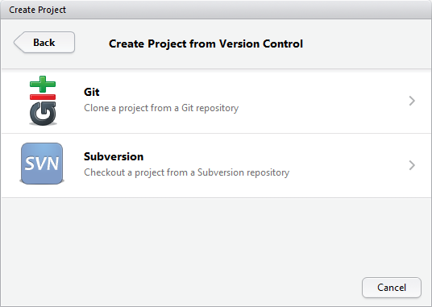
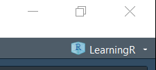

<!-- README.md is generated from README.Rmd. Please edit that file -->

# R Class

This is an empty repo to initialize an R project for [Introduction to
Programming in
R](https://www8.gsb.columbia.edu/courses/mba/2021/fall/b8144-001) at
[Columbia Business
School](https://www8.gsb.columbia.edu/courses/mba/2021/fall/b8144-001).

Please **follow all instructions** to set up your environment for the
training. Skimming the instructions often leads to errors, so be sure to
read everything.

# Install R and RStudio

This is just like installing any other program.

-   [R](https://cloud.r-project.org/)
-   [RStudio](https://www.rstudio.com/products/rstudio/download/#download)

It is important to have the most recent version of R, which as of this
repo creation was version 4.0.2.

# Getting the Repo

In order to get the most out of class you have to be working in this
project. There are three ways to get this project on your computer.

Choose **one of these methods** only. Trying parts from each method can
lead to undesirable results. Most people will be most comfortable with
the third method.

1.  Clone the repo using the command line
2.  Clone the repo using the RStudio GUI
3.  Use the [`{usethis}`](https://usethis.r-lib.org) package to download
    and unzip the repo

Please only follow one of these methods. Attempting more than one can
lead to errors.

## Command Line

This assumes you have `git`
[installed](https://git-scm.com/book/en/v2/Getting-Started-Installing-Git).[1]

Run this command in the command line or shell.

``` sh
git clone https://github.com/jaredlander/cbs2021fall.git
```

Then open the `cbs2021fall.Rproj` file.

## RStudio Gui

This assumes you have `git`
[installed](https://git-scm.com/book/en/v2/Getting-Started-Installing-Git).

Click `File > New Project`.

<!-- -->

Click `Version Control`.

<!-- -->

Click `Git`.

<!-- -->

Choose a folder in the `Create project as a subdirectory of` field.

Paste `https://github.com/jaredlander/cbs2021fall`[2] in the
`Repository URL` field.

<!-- -->

## `usethis` Package

Run these commands in the R console.

``` r
# install usethis package
install.packages('usethis')

# get the repo
newProject <- usethis::use_course('https://github.com/jaredlander/cbs2021fall/archive/master.zip')
```

Be sure to select the positive prompts such as `yes`, `yeah`, etc.

This will open the project in a new RStudio window.

After any of these methods you should have a new RStudio project called
`cbs2021fall` or `cbs2021fall-master`. You can see this in the top right
of RStudio (the name in the image may be different).

<!-- -->

# Finish Setup

Setting up all of the needed packages[3] and downloading data will be
handled by running the following lines of code in the R console.

``` r
source('prep/install_packages.r')
# this next line might cause errors
# if so, do not worry, we'll handle it in class
source('prep/download_data.r')
```

Answer `y` to any questions asked in the terminal. However, if the
question is asking you to install packages from source, answer “no.”

# All Done

That’s everything. You should now do all of your work for this class in
this project.

# If it Still Does Not Work

If you are still having trouble setting up the project and getting
everything installed, sign up for an
[RStudio.cloud](https://rstudio.cloud/) account, contact the TA and ask
for access to the class project.[4]

# Footnotes

[1] Can also be done with ssh instead of https.

[2] Or `git@github.com:jaredlander/cbs2021fall.git` for ssh.

[3] Linux users might need to install `libxml2-dev` and `zlib1g-dev`

[4] The compute instance has limited processing and memory so
performance on topics later in the semester may be suboptimal.
